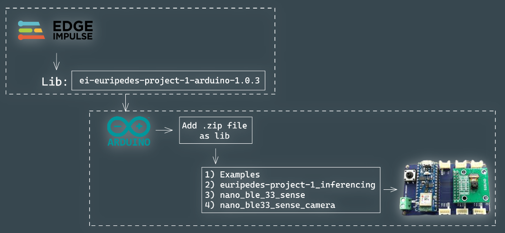

Here you can find the code to use in your arduino. Download the zip file, after that add it to your libs on your arduino IDE. Once that is done, check the examples section and seach for the lib you just added, now look for the camera inference thats is suitable to your board.

