# 🔥Fire Detection Using Image Classification

Since we're working on a embedded IA context having a device such as a drone or a surveillance camera that can indicate the presence of fire seems to be advantageous to have. With that in mind **Miguel Euripedes** created these models as part of the **transfer-learning** project of the discipline of Embedded AI, using Ivanovitch's notebooks as reference. These models are currently in the first version (1.0) and were created on November 27, 2022. A data pipeline was built using **Google Colab, TensorFlow** and **Weights & Bias** to store and train the models. The pre-trained models used where **VGG16, MobileNetV1, InceptionV3** and **ResNet50** with the objetive of classify if there is fire or not on a image. 

The big-picture of the project workflow is show below:

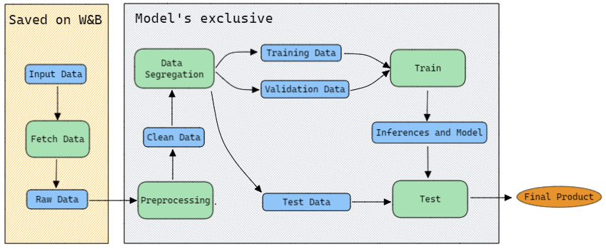

As part of this project I made a article and publish it on [Medium](https://medium.com/@miguel.amaral.111/fire-detection-example-using-image-classification-6f49b377c4b5), there I explain better the process of transfer-learning and how I used it in the training of models presented here. 

## 📁The DataSet

The dataset name is: “***Fire Detection Using Surveillance Camera on Roads***”, published by Rohan Roy on the Kaggle platform, it contains 10,003 images (real and synthetic) and was divided into 3 folders: Test, Train and Vali. Each of the folders has images separated by labels such as “fire” and “non-fire”. Here you have some images example:

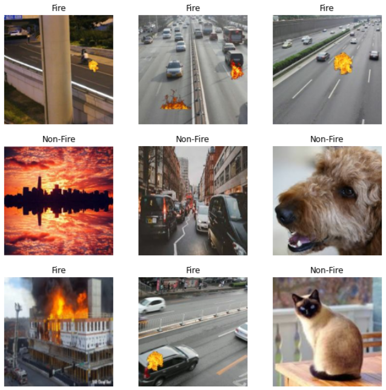

## 🚀 Model Training
As previously mentioned, the models were trained using Transfer-Learning knowledge. First, the dataset images were stored in the W&B and then, as the models were trained, the data were downloaded from the platform. 

### ✂️ Data Segregation

The data we have can be described as 10002 files  belonging to 2 classes.
This data was separated using  batches of `size 32` and following a proportion of *80% for training* and *20% for validation and test*. The image below describres better the distribution.

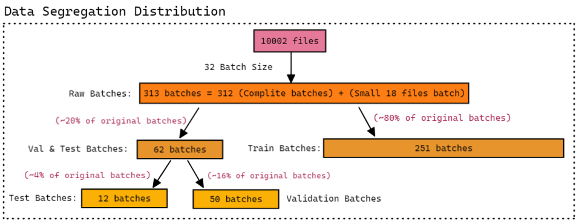

### 📖 Transfer Learning:

To train the models I used transfer-learning techniques, precisely **feature extraction** and **fine-tuning** for each pre-trained model, this process was well explained by the Medium article. But to give you an idea of how it was made the following image tries to represent this process.

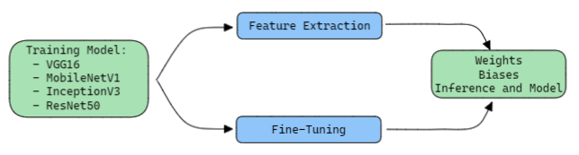

If you want to understand more, I would recommend taking a look at the actual codes, so here are the notebooks:

* **Fetch Data** - Notebook used to store the data in the WandB:
	1. [*Fire Detection - Fetch data*](https://github.com/MiguelEuripedes/embedded_AI/blob/main/Projects/fire_detection/Notebooks/FireDetection_FetchData_WandB.ipynb)

* **Training Models** - Notebooks used to train the models: 
	1. [*Fire Detection - VGG16 Model*](https://github.com/MiguelEuripedes/embedded_AI/blob/main/Projects/fire_detection/Notebooks/FireDetection_Train_VGG16.ipynb)
	2. [*Fire Detection - MobileNetV1 Model*](https://github.com/MiguelEuripedes/embedded_AI/blob/main/Projects/fire_detection/Notebooks/FireDetection_Train_MobileNet.ipynb)
	3. [*Fire Detection - InceptionV3 Model*](https://github.com/MiguelEuripedes/embedded_AI/blob/main/Projects/fire_detection/Notebooks/FireDetection_Train_InceptionV3.ipynb)
	4. [*Fire Detection - ResNet50 Model*](https://github.com/MiguelEuripedes/embedded_AI/blob/main/Projects/fire_detection/Notebooks/FireDetection_Train_ResNet50.ipynb)

## 📊Model Results

### 📏Table Results
---
Here we have the Accuracy, Precision, Recall and F1-score for each model. Here I share the Weights and Biases informations for each model.  

Models                           |Accuracy|Precision|Recall|F1-Score
--------------------------------|:--------:|:---------:|:------:|:--------:
[VGG16 - Feature Extraction](https://wandb.ai/euripedes/fire_detection_classifier/runs/4ac9fa10/logs?workspace=user-euripedes)  |  0.9427  | 0.9438  | 0.9427 | 0.9426
[VGG16 - Fine-Tuning](https://wandb.ai/euripedes/fire_detection_classifier/runs/42ekk0jc/logs?workspace=)     | 0.9766   | 0.9766    |  0.9766 | 0.9766
[MobileNetV1 - Feature Extraction](https://wandb.ai/euripedes/fire_detection_classifier/runs/1ccoxiye/logs?workspace=)   | 0.9609   | 0.9610    | 0.9609 | 0.9609
[MobileNetV1 - Fine-Tuning](https://wandb.ai/euripedes/fire_detection_classifier/runs/1vx0q3hn/logs?workspace=)     | 0.9792   | 0.9794    | 0.9792 | 0.9792
[InceptionV3 - Feature Extraction](https://wandb.ai/euripedes/fire_detection_classifier/runs/65atuf73/logs?workspace=) | 0.6589 | 0.7153  | 0.6588 | 0.6305
[InceptionV3 - Fine-Tuning](https://wandb.ai/euripedes/fire_detection_classifier/runs/33xdg1f6?workspace=)       | 0.9818   | 0.9819    | 0.9818 | 0.9818
[ResNet50 - Feature Extraction](https://wandb.ai/euripedes/fire_detection_classifier/runs/ouutgabr/logs?workspace=)   | 0.7526 | 0.7633    | 0.7526 | 0.7516
[ResNet50 - Fine-Tuning](https://wandb.ai/euripedes/fire_detection_classifier/runs/1fctzcij/logs?workspace=)              | 0.9844   | 0.9844    | 0.9844 | 0.9844

### 🔎Individual Results
--- 
Here will be display the models **Graph of Acc and Loss per epoch** and the **Confusion Matrix** together.
* **VGG16**
	
	
*1. Feature Extraction* 

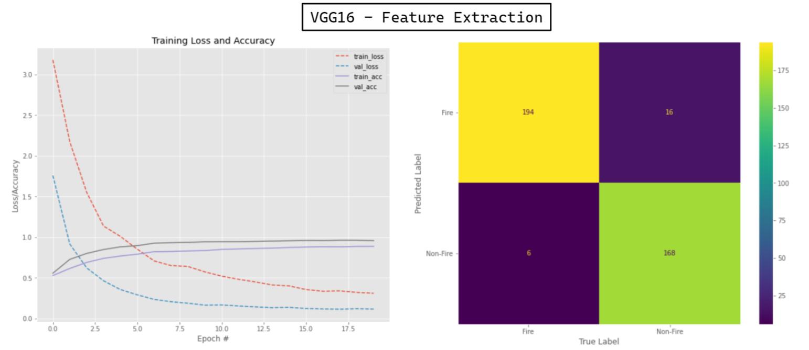

*2. Fine-Tuning*

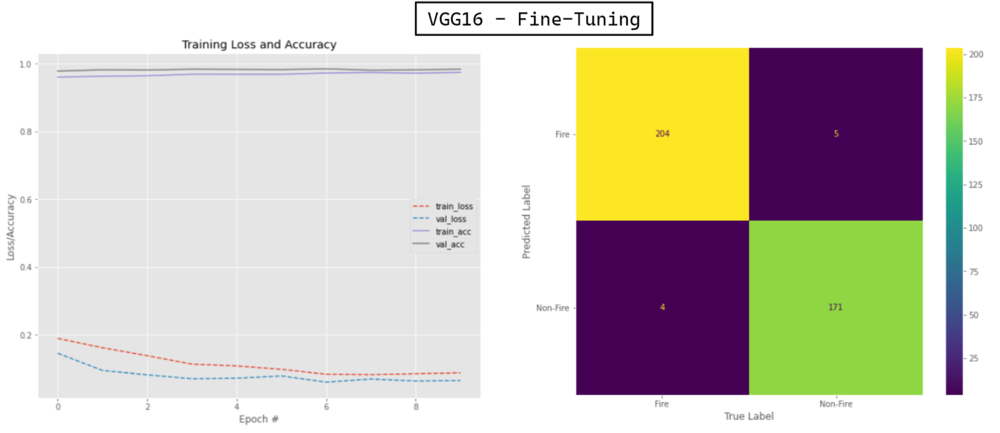

* **MobileNetV1**
	
	
*1. Feature Extraction*

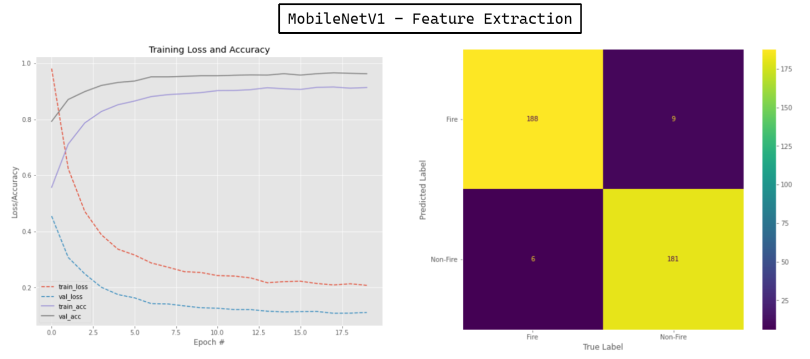

*2. Fine-Tuning*

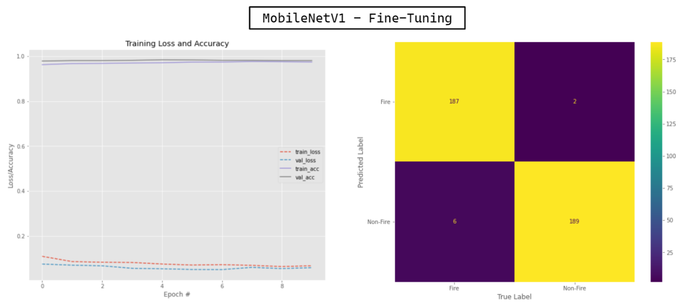

* **InceptionV3**
	
	
*1. Feature Extraction*

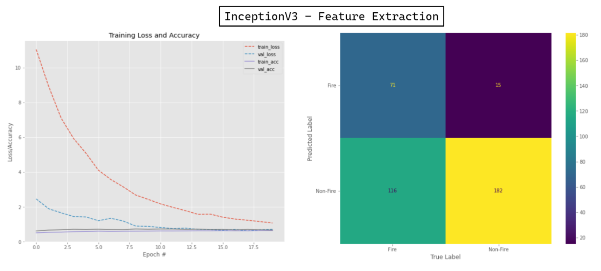

*2. Fine-Tuning* 

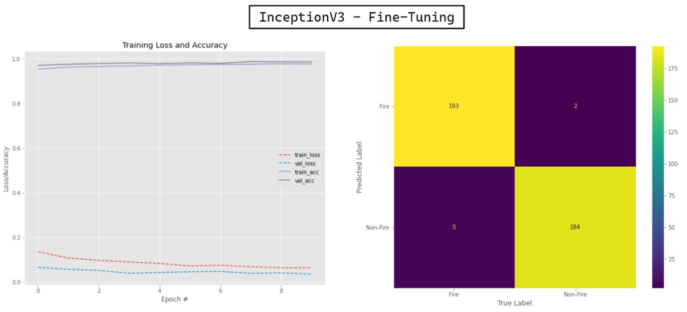

* **ResNet50**
	
	
*1. Feature Extraction*

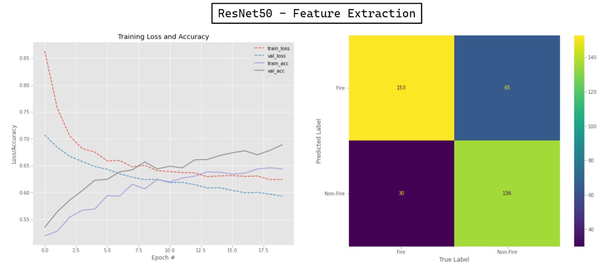

*2. Fine-Tuning*

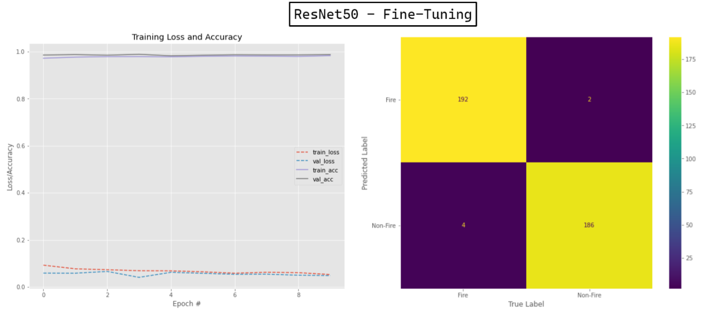

### 📌Predictions Visualization
Now for conclusionwe can see some example of theses models predictions:
* For the Feature Extraction Models:

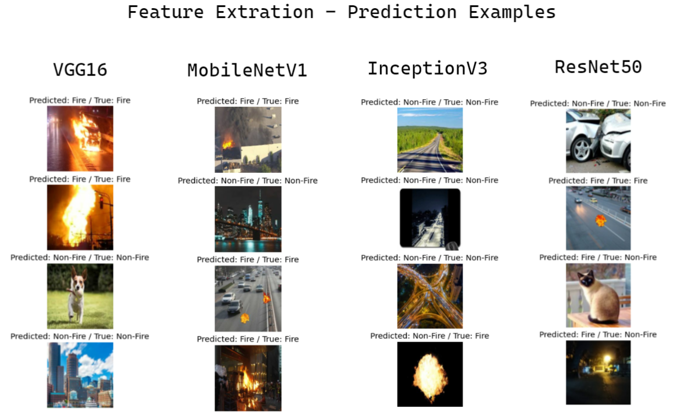

* For the Fine-Tuning Models

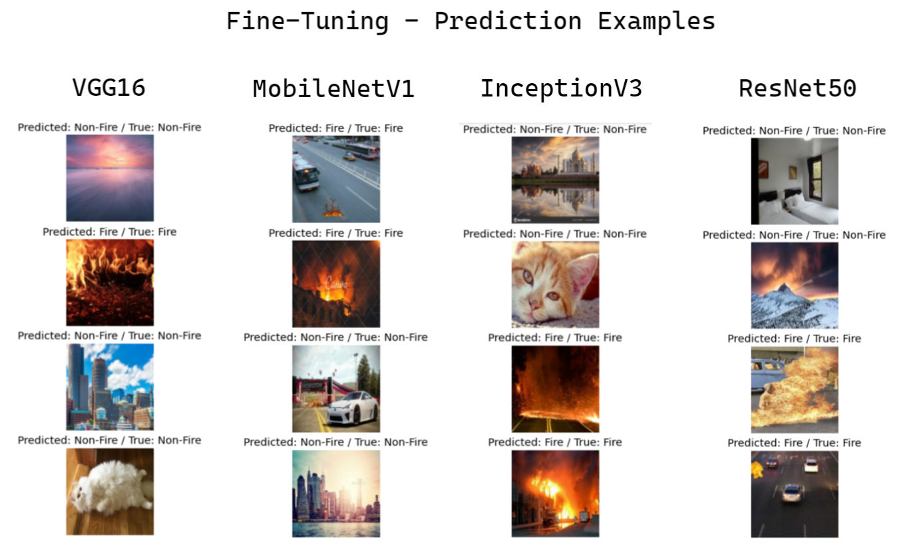

## ♻️ Energy consumption and CO2 Emission

These number refer to the sum of the amount generated when I finished training all models.
Provided by [CodeCarbon](https://codecarbon.io/) 

* **Electricity used since the begining:** 0.20480884559594045 kWh 
* **Energy consumed for RAM:** 0.00922542330030261 kWh
* **Energy consumed for all GPU:** 0.11306839645808399 kWh
* **Energy consumed for all CPU:** 0.08251502583755388 kWh
* **CO2 emission:** 0.041922837497629754 (in Kg)

# Reference

[Ivanovitch's repository for embedded artificial intelligence repository](https://github.com/ivanovitchm/embedded.ai)
