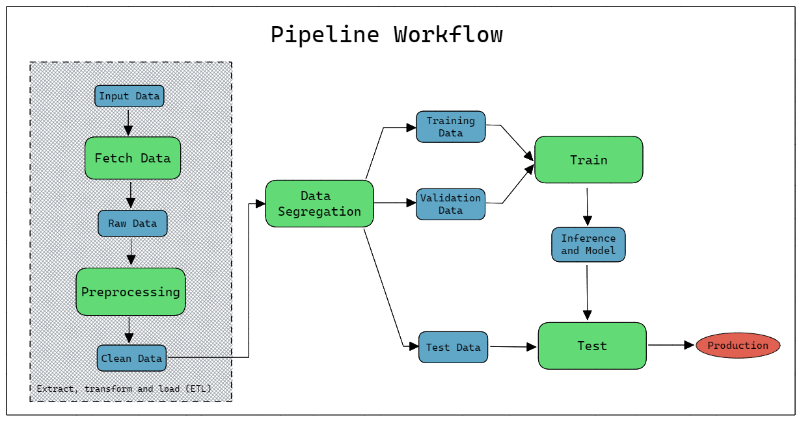
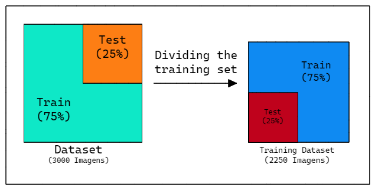

# Model Card: First Image Classifier Project

Model cards are a succinct approach for documenting the creation, use, and shortcomings of a model. The idea is to write a documentation such that a non-expert can understand the model card's contents. For additional information see the Model Card paper: https://arxiv.org/pdf/1810.03993.pdf

## Model Details
Miguel Euripedes created these models as part of the first project of the discipline of Embedded AI, using Ivanovitch's notebooks as reference. These models are currently in the first version (1.0) and were created on October 16, 2022.
A complete data pipeline was built using Google Colab, Scikit-Learn and Weights & Bias to train a KNN model, a MLP model and finally a CNN model. 

The big-picture of the data pipeline for all 3 models is shown below:

In the figure above, for each green block represents a colab notebook that can be found in the repository. For each project the `fetch_data` stage is commom to all of them
That said for each model they all have a individual set of notebooks made specially for the model. Even so, they follow the pattern shown in the figure, where the green blocks represent the notebooks that generate the artifacts (blue blocks) to be stored at the WandB project.

For each model, the following hyperparameters were first selected:

    - KNN Classifier: 
        - n_neighbors = 1 
        - n_jobs = -1
    - MLP Classifier:
        - Hidden layers: (256,256, 256) - 3 with 256 neurons each 
        - Activation = 'relu'
        - Solver = 'adam'
        - Max interactions = 1000
        - Learning rate = 'constant'
    - CNN Classifier:
        - Convolutional layer = 1
        - Batch size = 32
        - Epochs = 100
        - Hidden layer = None
        - Learning rate = 0.005

Later in the projects, specially the MLP and CNN models, it was used W&B's hyperparameter tuning tool (Sweep), so at the end of the project the stored model may receive different values ​​from those mentioned above

## Intended Use
This model is used as a proof of concept for the evaluation of an entire data pipeline incorporating Machine Learning fundamentals used in the undergraduate course. The data pipeline is composed of the following stages: a) ``fecht data``, b) ``preprocess``, c) ``data segregate``, e) ``train`` and f) ``test``.

## Training Data

The purpose of this dataset is to correctly classify an image as containing a dog, cat, or panda. Containing only 3,000 images, the Animals dataset is meant to be another **introductory** dataset
that we can quickly train a KNN model, a simple MLP model or even a CNN model, all that in order to obtain initial results (no so good accuracy) that has potential to be used as a baseline. 

After the EDA stage of the data pipeline, it was noted that the images in training data has different resolutions. A pre-processing stage is necessary in order to normalize all images using the same size. 

Below there is a figure showing the data distribution in each class.

## Evaluation Data
The dataset under study is split into Train and Test during the ``Segregate`` stage of the data pipeline. 75% of the clean data is used to Train and the remaining 25% to Test. Inside the 75% we do one more division in order to obtain a 50% for training only data and 25% for validation data, these two last percentages are related to the total data used in the process that is 3000 images. 

## Metrics
In order to follow the performance of machine learning experiments, the project marked certains stage outputs of the data pipeline as metrics. The metrics adopted are: [accuracy](https://scikit-learn.org/stable/modules/generated/sklearn.metrics.accuracy_score.html), [f1](https://scikit-learn.org/stable/modules/generated/sklearn.metrics.f1_score.html#sklearn.metrics.f1_score), [precision](https://scikit-learn.org/stable/modules/generated/sklearn.metrics.precision_score.html#sklearn.metrics.precision_score), [recall](https://scikit-learn.org/stable/modules/generated/sklearn.metrics.recall_score.html#sklearn.metrics.recall_score).

To calculate the evaluations metrics is only necessary to run:

- [KNN classifier](https://wandb.ai/euripedes/first_image_classifier?workspace=user-euripedes)

- [MLP classifier](https://wandb.ai/euripedes/mlp_classifier?workspace=user-euripedes)

- [CNN classifier](https://wandb.ai/euripedes/cnn_classifier?workspace=user-euripedes)

The follow results will be shown:

 **Algorithm**  |  **Stage [Run]**                        | **Accuracy** | **F1** | **Precision** | **Recall** | 
----------------|---------------------------------|--------------|--------|---------------|------------|
 KNN    | [comfy-universe-5](https://wandb.ai/euripedes/first_image_classifier/runs/1sc557k5?workspace=user-euripedes) | 0.45467  | 0.45752 | 0.54418  | 0.45467  |  
 MLP    | [worthy-smoke-121](https://wandb.ai/euripedes/mlp_classifier/runs/2qnuo3m9?workspace=user-euripedes)  | 0.56933      | 	0.55751 | 0.55797       |	0.56933    |
 CNN    | [super-flower-9](https://wandb.ai/euripedes/cnn_classifier/runs/28rj00jp?workspace=user-euripedes) | 0.6773      | 0.67 | 0.6757        | 0.6773     |  

You can check the `test` notebook as well, where you can find the same informations:

 - [KNN Test - Notebook](https://github.com/MiguelEuripedes/embedded_AI/blob/main/Projects/first_image_classifier/knn_classifier/Test_KNN.ipynb)
 - [MLP Test - Notebook](https://github.com/MiguelEuripedes/embedded_AI/blob/main/Projects/first_image_classifier/mlp_classifier/test_MLP.ipynb)
 - [CNN Test - Notebook](https://github.com/MiguelEuripedes/embedded_AI/blob/main/Projects/first_image_classifier/cnn_classifier/test_CNN.ipynb) 

## Ethical Considerations

We may be tempted to claim that this dataset contains the only attributes capable of predicting if there is a cat, dog or a panda in an image. However, this is not the case. The dataset is composed of 3,000 images, which is a small number of images to train a model. The dataset is also composed of images with different resolutions, which may lead to a model that is not robust to different image sizes.
## Caveats and Recommendations
It should be noted that the model trained in this project was used only for validation of a complete data pipeline. It is notary that some important issues related to size of images exist, and adequate techniques need to be adopted in order to balance it. Including data augmentation techniques, for example. Other more appropriate models should be used in order to obtain better results such as others CNNs models.

## References
- [Ivanovitch's repository for embedded artificial intelligence repository](https://github.com/ivanovitchm/embedded.ai)
