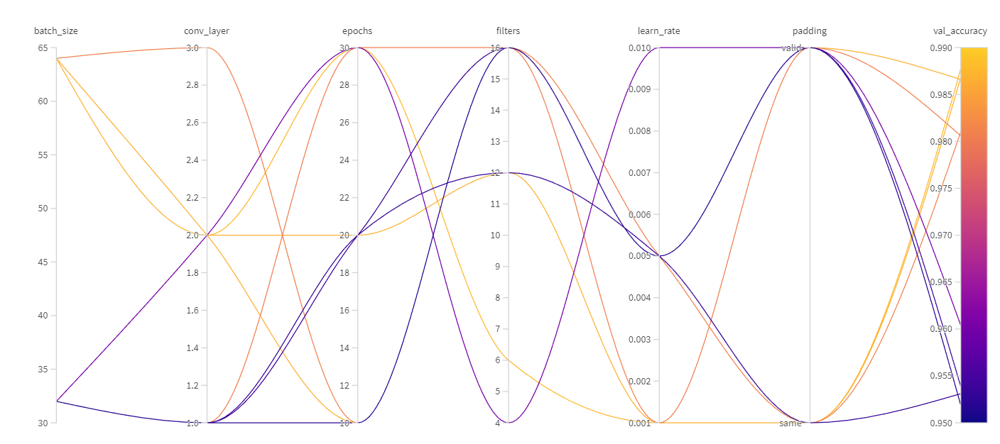
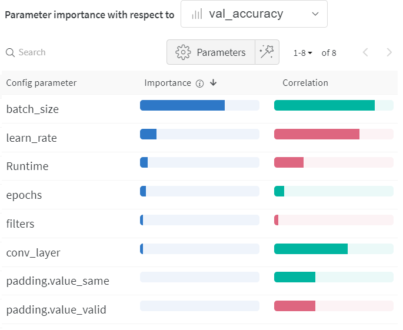
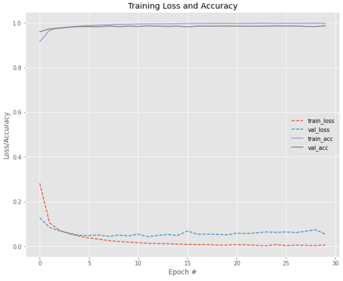
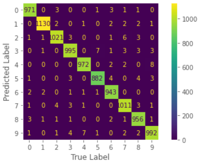

# LeNet-5 Model

For this first model, the proposed idea is to evaluate the original LeNet-5 architecture and then run the hyperparameter tuning.

The proposal is to verify the model results with the first configuration and then, through Sweep, try to achieve a better result.

For this, we first evaluate the original model:

## 🚩Original Model

Since our focus here is the use of [W&B Sweeps](https://docs.wandb.ai/guides/sweeps) we'll present just the evaluation metrics of the first model.

* **Validation Accuracy:** 0.95
* **Validation Precision:** 0.9503128302234857
* **Validation Recall:** 0.95
* **Validation F1:** 0.9498777559017514

Now our mission is to achieve a better result than the one above.

*It's important remember that the model architecture is well explained in the notebook* 

## 🚀 Hyperparameter Tunining
Now, we can finally check the results after hyperparameter tuning:

### Sweep: Hyperparameters configuration

These are the possibilities for each hyperparameter for Sweep to chose. It's important to highlight that we are using W&B **random method** which means that at the end the models configurations are not necessarily the best possible.
I decided to use this method in order to experiment better the use of our hyperparameter tuning tool.

* `conv_layer`: *The number of convolutional layers. The values range from 1 to 3*;
* `filters`: *This represents the number of filters in each convolutional layers. The values could be: 4, 6, 12 or 16;*
* `padding`: *The padding for the convolutional layer could be the same or the 'valid', which means that the layer only uses valid input data.*
* `learn_rate`:  *Values are 0.01, 0.001 or 0.005*;
* `epochs`: *Values are 10, 20 or 30*;
* `batch_size`: *Values are 32 or 64*.

*The values chose here are selected by me only for the purpose of testing them*

### Sweep: Hyperparameters VS Results

### Sweep: Parameter importance

This serves to visualize the relationships between our model hyperparameters and output metrics.

*The green correlation means that its a positive one and hence the red one a negative correlation*

The three most important parameter were:

    1. `batch_size`: With 0.840 correlation.
    2. `learn_rate`: With -0.711 correlation.
    3. `Runtime`: With -0.244 correlation.

## 📈 Best model 
Finally we have the Best Model.

### Network Configuration
After training our Sweep, we ended with this configuration of hyperparameters as the best one. (Remember the disclaimer presented before, its not the best possible to achieve)

* `conv_layer` = 2;
* `filters` = 6;
* `padding` = 'same';
* `learn_rate` = 0.001;
* `epochs` = 30;
* `batch_size` = 64;

### Network Training Loss and Accuracy x Epochs

### Network Evaluation 

 This our classification report for the best model:

|              | Precision | Recall | F1-Score | Support |
|--------------|-----------|--------|----------|---------|
| 0            | 0.99      |  0.99  |    0.99  |    980  |
| 1            | 0.99      |  1.00  |    0.99  |   1135  |
| 2            | 0.99      |  0.99  |    0.99  |   1032  |
| 3            | 0.98      |  0.99  |    0.98  |   1010  |
| 4            | 0.99      |  0.99  |    0.99  |    982  |
| 5            | 0.98      |  0.99  |    0.99  |    892  |
| 6            | 0.99      |  0.98  |    0.99  |    958  |
| 7            | 0.99      |  0.98  |    0.99  |   1028  |
| 8            | 0.99      |  0.98  |    0.99  |    974  |
| 9            | 0.98      |  0.98  |    0.98  |   1009  |
| accuracy     |           |        |    0.99  |  10000  |
| macro avg    | 0.99      |  0.99  |    0.99  |  10000  |
| Weighted avg | 0.99      |  0.99  |    0.99  |  10000  |

### Network Confusion Matrix

### Validation Evaluation Metrics
Now we can check precisely the scores for the evaluation metrics:

* **Validation Accuracy:** 0.9873
* **Validation Precision:** 0.9873088361428725
* **Validation Recall:** 0.9873
* **Validation F1:** 0.987298779748653

### ♻️ Energy consumption and CO2 Emission

Provided by [CodeCarbon](https://codecarbon.io/) 

* **Electricity used since the begining:** 0.002535853084691442 kWh 
* **Energy consumed for RAM:** 0.00015756010619515527 kWh
* **Energy consumed for all GPU:** 0.0009692661255839136 kWh
* **Energy consumed for all CPU:** 0.001409026852912373 kWh
* **CO2 emission:** 0.0011477797888429745(in Kg)

# Reference

[Ivanovitch's repository for embedded artificial intelligence repository](https://github.com/ivanovitchm/embedded.ai)
