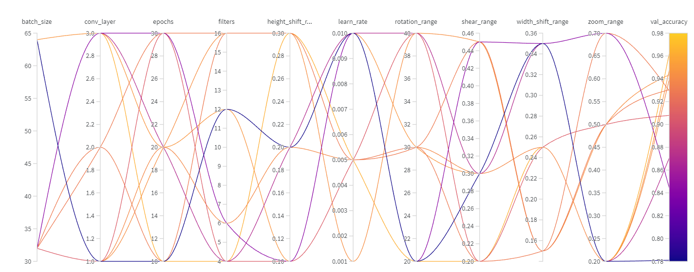
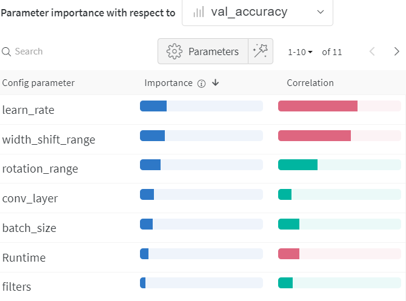
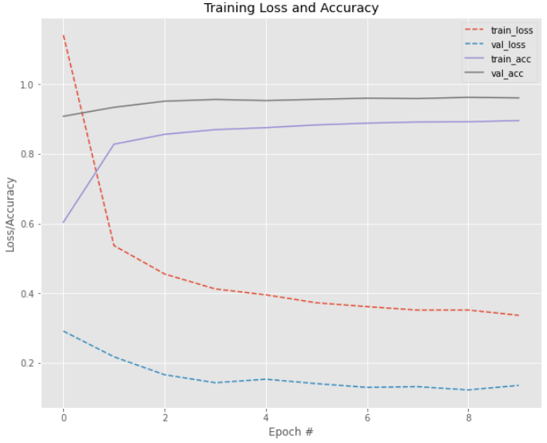
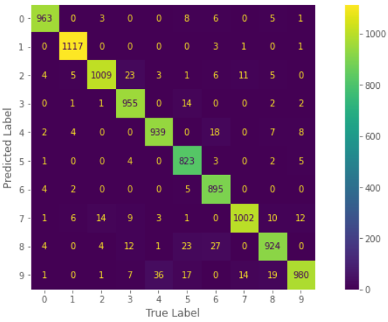

# LeNet-5 Model - Using Data Augmentation

For this second model, the proposed idea is to evaluate the original LeNet-5 architecture again, but this time we'll be using a technic called "Data Augmentation", and besides that we'll also be running W&B hyperparameter tuning ([Sweeps](https://docs.wandb.ai/guides/sweeps)).

The proposal is to verify the model results with the first configuration using some data augmentation in the process and then, through Sweep, try to achieve a better result.

For this, we first evaluate the original model and what kind of data augmentation was used:

## 🚩Original Model

Since our focus here is the use of data augmentation in the process and to use Sweeps we'll present what kind of augmentation was done and the evaluation metrics results of this second model.

**Data Augmentation**
* **Rotation:** 30
* **Width Shift:** 0.1
* **Height Shift:** 0.1
* **Shear:** 0.2
* **Zoom:** 0.2

**Evaluation metrics**
* **Validation Accuracy:** 0.9226
* **Validation Precision:** 0.92541446136749
* **Validation Recall:** 0.9226
* **Validation F1:** 0.9223152026743395

Now our mission is to achieve a better result than the one above.

*It's important remember that the model architecture is well explained in the notebook as well as what Data Augmentation is* 
[](https://github.com/MiguelEuripedes/embedded_AI/blob/main/Projects/mnist_with_lenet/LeNet-5_with_Data_Augmentation/LeNet_5_DataAugmentation.ipynb)

## 🚀 Hyperparameter Tunining
Now, we can finally check the results of the hyperparameter tuning:

### Sweep: Hyperparameters configuration

These are the possibilities for each hyperparameter for Sweep to chose. It's important to highlight that we are using W&B **random method** which means that at the end the models configurations are not necessarily the best possible.
I decided to use this method in order to experiment better the use of our hyperparameter tuning tool.

Since we are doing Data Augmentation in the process we used Sweeps to also configure our augmentation.

**Augmentation parameters for the Data Generator**
* `rotation_range`: *Rotations can be of values 20, 30 or 40*;
* `width_shift_range`: *We can shift using values 0.15, 0.25 or 0.35*;
* `height_shift_range`: *We can shift using values 0.1, 0.2 or 0.3*;
* `shear_range` : *To shear the images we select the value 0.2, 0.3 or 0.45*;
* `zoom_range` : *The values for zooming the images can be 0.2, 0.5 or 0.7*;

**Normal LeNet-5 model parameters**
* `conv_layer`: *The number of convolutional layers. The values range from 1 to 3*;
* `filters`: *This represents the number of filters in each convolutional layers. The values could be: 4, 6, 12 or 16;*
* `learn_rate`:  *Values are 0.01, 0.001 or 0.005*;
* `epochs`: *Values are 10, 20 or 30*;
* `batch_size`: *Values are 32 or 64*.

*The values chose here are selected by me only for the purpose of testing them*

### Sweeps Metrics:

Model                           |Accuracy|Precision|Recall|F1-Score
--------------------------------|:--------:|:---------:|:------:|:--------:
[laced-sweep-3](https://wandb.ai/euripedes/lenet-5-augmentation/runs/g2x3sqkk?workspace=user-euripedes)               | 0   | 0    | 0 | 0
[exalted-sweep-4](https://wandb.ai/euripedes/lenet-5-augmentation/runs/c5dqm357?workspace=user-euripedes)                 | 0.781   | 0.7897    | 0.781 | 0.777 
[swept-sweep-5](https://wandb.ai/euripedes/lenet-5-augmentation/runs/hou8i3o8?workspace=user-euripedes)              | 0.8443   | 0.8516    | 0.8443 | 0.8411
[usual-sweep-6](https://wandb.ai/euripedes/lenet-5-augmentation/runs/2g5gi2oe?workspace=user-euripedes)               | 0.9304    | 0.9316    | 0.9304  | 0.9298
[fresh-sweep-7](https://wandb.ai/euripedes/lenet-5-augmentation/runs/0xjwhzpp?workspace=user-euripedes)                 | 0.9397   | 0.9401    | 0.9397 | 0.9397
[skilled-sweep-8](https://wandb.ai/euripedes/lenet-5-augmentation/runs/jbzlfwws?workspace=user-euripedes)                | 0.9476   | 0.9481    | 0.9476 | 0.9476
[absurd-sweep-9](https://wandb.ai/euripedes/lenet-5-augmentation/runs/agm8g9nw?workspace=user-euripedes)                 | 0.9294   | 0.9319    | 0.9294 | 0.9294
[copper-sweep-10](https://wandb.ai/euripedes/lenet-5-augmentation/runs/xewege4w?workspace=user-euripedes)                  | 0.9435   | 0.9449     | 0.9435 | 0.9434
[cool-sweep-11](https://wandb.ai/euripedes/lenet-5-augmentation/runs/znedrpy5?workspace=user-euripedes)                | 0.9079   | 0.9086    | 0.9079 |  0.9076
[dashing-sweep-12](https://wandb.ai/euripedes/lenet-5-augmentation/runs/cw3w1wa3?workspace=user-euripedes)                | 0.9623   | 0.9627    | 0.9623 |  0.9623

*Note that the first Sweep has its metrics zeroed, these values were put only to fill the table since due to an unexpected error it was not possible to recover the post training metrics of this model*

### Sweep: Hyperparameters VS Results

<p align="center">


### Sweep: Parameter importance

This serves to visualize the relationships between our model hyperparameters and output metrics.

<p align="center">


*The green correlation means that its a positive one and hence the red one a negative correlation*

The five most important parameter were:

    1. `learn_rate`: With -0.644 correlation.
    2. `width_shift_range`: With -0.591 correlation.
    3. `rotation_range`: With 0.321 correlation.
    4. `conv_layer`: With 0.109 correlation.
    5. `batch_size`: With 0.169 correlation.

## 📈 Best model 
Finally we have the Best Model.

### Network Configuration
After training our Sweep, we ended with this configuration of hyperparameters as the best one. (Remember the disclaimer presented before, its not the best possible to achieve)

* `batch_size`: 64
* `conv_layer`: 3
* `epochs`: 10
* `filters`: 4
* `learn_rate`: 0.005
* `height_shift`: 0.3
* `width_shift`: 0.25
* `rotation`: 20
* `shear`: 0.2
* `zoom`: 0.2

### Network Training Loss and Accuracy x Epochs

<p align="center">


### Network Evaluation 

 This our classification report for the best model:

|              | Precision | Recall | F1-Score | Support |
|--------------|-----------|--------|----------|---------|
| 0            | 0.98      |  0.98  |    0.98  |    980  |
| 1            | 1.00      |  0.98  |    0.99  |   1135  |
| 2            | 0.95      |  0.98  |    0.96  |   1032  |
| 3            | 0.98      |  0.95  |    0.96  |   1010  |
| 4            | 0.96      |  0.96  |    0.96  |    982  |
| 5            | 0.98      |  0.92  |    0.95  |    892  |
| 6            | 0.99      |  0.93  |    0.96  |    958  |
| 7            | 0.95      |  0.97  |    0.96  |   1028  |
| 8            | 0.93      |  0.95  |    0.94  |    974  |
| 9            | 0.91      |  0.97  |    0.94  |   1009  |
| accuracy     |           |        |    0.96  |  10000  |
| macro avg    | 0.96      |  0.96  |    0.96  |  10000  |
| Weighted avg | 0.96      |  0.96  |    0.96  |  10000  |

### Network Confusion Matrix

<p align="center">


### Validation Evaluation Metrics
Now we can check precisely the scores for the evaluation metrics:

* **Validation Accuracy:** 0.9607
* **Validation Precision:** 0.9615428118319694
* **Validation Recall:** 0.9607
* **Validation F1:** 0.9607780495135098
    
### 🏆 **Network Result**.
At the end our model achieved:

```bash
  96.07% of Accuracy! 
```
Compared to the 92,26% presented by the original model its a considerable improvement, not as good as the first model, but this could be due to the use of unsuitable values for the data augmentation parameters. One thing that could be done is to change the method of our Sweep configuration in order to obtain the best possible model given those parameters, but that requires a significant amount of time to train.


### ♻️ Energy consumption and CO2 Emission

These metrics were obtained just for the training of our best model.
Provided by [CodeCarbon](https://codecarbon.io/) 

* **Electricity used since the begining:** 0.00401040381418897 kWh 
* **Energy consumed for RAM:** 0.000252571246478027 kWh
* **Energy consumed for all GPU:** 0.0014988372699942193 kWh
* **Energy consumed for all CPU:** 0.0022589952977167243 kWh
* **CO2 emission:** 0.0025304972853051723(in Kg)

# Reference

[Ivanovitch's repository for embedded artificial intelligence repository](https://github.com/ivanovitchm/embedded.ai)
