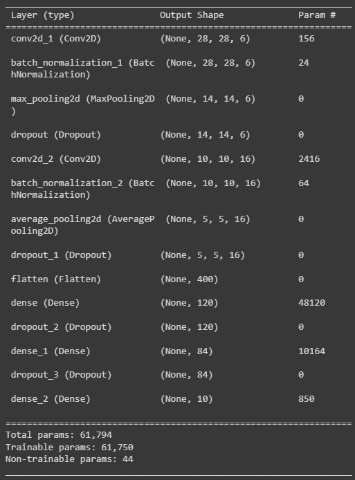
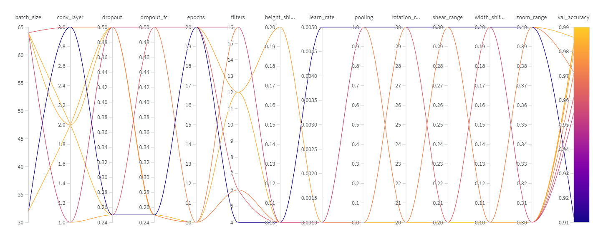
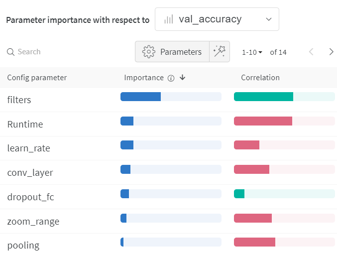
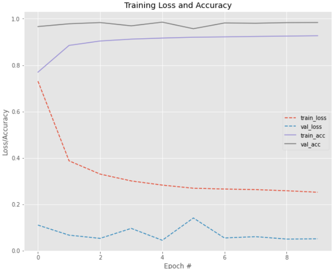
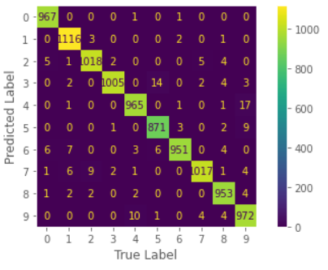

# PadocaNet Model

For this last model, the proposed idea is to explore the use of Batch Normalization, Droupout and another activation function (like 'ReLu') in the LeNet-5 model that we've been using so far. So we'll add some of these new tools in our network and create a totally new one. After that we'll be using again "Data Augmentation" in order to create a more generalized model.

When we're done with our first version of PacodaNet we'll be running W&B hyperparameter tuning ([Sweeps](https://docs.wandb.ai/guides/sweeps)) on it, and look if we can improve its results.

For this, we first evaluate the first version of the model and what kind of data augmentation was used:

## 🚩Original Model

Since our focus here is the use Batch Normalization, Droupout and so... I decided to not change the original architecture (at some point) and just experiment with values for my dropout and when placing the batch Normalization layers after the convolutional layers. 

For a better understanding of the new network we can see the model summary below: 

<p align="center">


But, since I used some data augmentation I should mention it here:

**Data Augmentation**
* **Rotation:** 40
* **Width Shift:** 0.2
* **Height Shift:** 0.2
* **Shear:** 0.2
* **Zoom:** 0.5

**Evaluation metrics**
* **Validation Accuracy:** 0.94
* **Validation Precision:** 0.9423053271626246
* **Validation Recall:** 0.94
* **Validation F1:** 0.9398930240646992

As can see the result were not good. Now our mission is to achieve a better result than the one above.

*It's important remember, check the notebook in order to understand better the process made throughth this assignment* 
[](https://github.com/MiguelEuripedes/embedded_AI/blob/main/Projects/mnist_with_lenet/PadocaNet/PaDoCa_Net.ipynb)

## 🚀 Hyperparameter Tunining
Now, we can finally check the results of the hyperparameter tuning:

### Sweep: Hyperparameters configuration

These are the possibilities for each hyperparameter for Sweep to chose. It's important to highlight that we are using W&B **random method** which means that at the end the models configurations are not necessarily the best possible.
I decided to use this method in order to experiment better the use of our hyperparameter tuning tool.

Since we are doing Data Augmentation in the process we used Sweeps to also configure our augmentation.

**Augmentation parameters for the Data Generator**
* `rotation_range`: *Rotations can be of values 20 or 30*;
* `width_shift_range`: *We can shift using values 0.1 or 0.2*;
* `height_shift_range`: *We can shift using values 0.1 or 0.2*;
* `shear_range` : *To shear the images we select the value 0.2 or 0.3*;
* `zoom_range` : *The values for zooming the images can be 0.3 or 0.4*;

**PadocaNet model parameters**
* `conv_layer`: *The number of convolutional layers. The values range from 1 to 4*;
* `filters`: *This represents the number of filters in each convolutional layers. The values could be: 6, 12 or 16;*
* `learn_rate`:  *Values are 0.001 or 0.005*;
* `epochs`: *Values are 10 or 20*;
* `batch_size`: *Values are 32 or 64*;
* `dropout`: *Values of the dropout can be 0.25 or 0.5*;
* `dropout_fc`: *This represents the dropout in the Fully Connected layers, which can assume values of 0.25 or 0.5*;
* `pooling`: *In order to experiment better our new network this parameter will indicate what type of pooling will be done in the process of training, if the choosen value is 1 then the model will use MaxPooling, otherwise (if equals to zero) it will use AveragePooling*.

*The values chose here are selected by me only for the purpose of testing them*

### Sweeps Metrics:

Model                           |Accuracy|Precision|Recall|F1-Score
--------------------------------|:--------:|:---------:|:------:|:--------:
[golden-sweep-1](https://wandb.ai/euripedes/padoca-net/runs/364c2b1e?workspace=user-euripedes)               | 0.9835  | 0.9837    | 0.9835 | 0.9835
[silver-sweep-2](https://wandb.ai/euripedes/padoca-net/runs/hft3ys3b?workspace=user-euripedes)                 | 0.9715   | 0.9716    | 0.9715 | 0.9714 
[dutiful-sweep-3](https://wandb.ai/euripedes/padoca-net/runs/28gogepj?workspace=user-euripedes)              | 0.9797   | 0.9799    | 0.9797 | 0.9796
[youthful-sweep-4](https://wandb.ai/euripedes/padoca-net/runs/k508hypq?workspace=user-euripedes)               | 0.9119    | 0.9203    | 0.9119  | 0.9129
[light-sweep-5](https://wandb.ai/euripedes/padoca-net/runs/jn41yqzb?workspace=user-euripedes)                 | 0.9834   | 0.9835    | 0.9834 | 0.9833
[blooming-sweep-6](https://wandb.ai/euripedes/padoca-net/runs/z7sx4t2v?workspace=user-euripedes)                | 0.9712   | 0.9720    | 0.9712 | 0.9712
[silver-sweep-7](https://wandb.ai/euripedes/padoca-net/runs/6tlymx50?workspace=user-euripedes)                 | 0.9615   | 0.9627    | 0.9615 | 0.9615
[stellar-sweep-8](https://wandb.ai/euripedes/padoca-net/runs/7atsuw4u?workspace=user-euripedes)                  | 0.9549   | 0.9581     | 0.9549 | 0.9551
[earthy-sweep-9](https://wandb.ai/euripedes/padoca-net/runs/xwojdocl?workspace=user-euripedes)                | 0.9825   | 0.9826    | 0.9825 |  0.9824
[warm-sweep-10](https://wandb.ai/euripedes/padoca-net/runs/5o8rvlh8?workspace=user-euripedes)                | 0.9858   | 0.9858    | 0.9858 |  0.9858

### Sweep: Hyperparameters VS Results

<p align="center">


### Sweep: Parameter importance

This serves to visualize the relationships between our model hyperparameters and output metrics.

<p align="center">


*The green correlation means that its a positive one and hence the red one a negative correlation*

The five most important parameter were:

    1. `filters`: With 0.584 correlation.
    2. `Runtime`: With -0.577 correlation.
    3. `learn_rate`: With -0.252 correlation.
    4. `conv_layer`: With -0.350 correlation.
    5. `dropout_fc`: With 0.102 correlation.

## 📈 Best model 
Finally we have the Best Model.

### Network Configuration
After training our Sweep, we ended with this configuration of hyperparameters as the best one. (Remember the disclaimer presented before, its not the best possible to achieve)

* `batch_size`: 64
*	`conv_layer`: 2
* `dropout`: 0.25
* `dropout_fc`: 0.25
* `epochs`: 10
* `filters`: 12
*	`height_shift_range`: 0.1
*	`learn_rate`: 0.005
*	`pooling`: 1
*	`rotation_range`: 30
*	`shear_range`: 0.2
*	`width_shift_range`: 0.1
*	`zoom_range`: 0.4

### Network Training Loss and Accuracy x Epochs

<p align="center">


### Network Evaluation 

 This our classification report for the best model:

|              | Precision | Recall | F1-Score | Support |
|--------------|-----------|--------|----------|---------|
| 0            | 1.00      |  0.99  |    0.99  |    980  |
| 1            | 0.99      |  0.98  |    0.99  |   1135  |
| 2            | 0.98      |  0.99  |    0.99  |   1032  |
| 3            | 0.98      |  1.00  |    0.99  |   1010  |
| 4            | 0.98      |  0.98  |    0.98  |    982  |
| 5            | 0.98      |  0.98  |    0.98  |    892  |
| 6            | 0.97      |  0.99  |    0.98  |    958  |
| 7            | 0.98      |  0.99  |    0.98  |   1028  |
| 8            | 0.99      |  0.98  |    0.98  |    974  |
| 9            | 0.98      |  0.96  |    0.97  |   1009  |
| accuracy     |           |        |    0.98  |  10000  |
| macro avg    | 0.98      |  0.98  |    0.98  |  10000  |
| Weighted avg | 0.98      |  0.98  |    0.98  |  10000  |

### Network Confusion Matrix

<p align="center">


### Validation Evaluation Metrics
Now we can check precisely the scores for the evaluation metrics:

* **Validation Accuracy:** 0.9835
* **Validation Precision:** 0.9835747950746876
* **Validation Recall:** 0.9835
* **Validation F1:** 0.9834960113382216
    
### 🏆 **Network Result**.
At the end our model achieved:

```bash
  98.35% of Accuracy! 
```
Compared to the 94% presented by the original model its a considerable improvement, the best improvement we had 4.35%. The two other models got a improvement of approximately 3.73%(LeNet-5) and 3.81%(LeNet-5 with Data augmentation). But besides that PacodaNet wasn't the best model created, which as the first one. 

One thing that could be done is to change the method of our Sweep configuration in order to obtain the best possible model given those parameters, but that requires a significant amount of time to train, even using dropouts in the network.

### ♻️ Energy consumption and CO2 Emission

These metrics were obtained just for the training of our best model.
Provided by [CodeCarbon](https://codecarbon.io/) 

* **Electricity used since the begining:** 0.0050898996639660845 kWh 
* **Energy consumed for RAM:** 0.00031348513751246817 kWh
* **Energy consumed for all GPU:** 0.001972681202276879 kWh
* **Energy consumed for all CPU:** 0.0028037333241767355 kWh
* **CO2 emission:** 0.0032116409915061445(in Kg)

# Reference

[Ivanovitch's repository for embedded artificial intelligence repository](https://github.com/ivanovitchm/embedded.ai)

