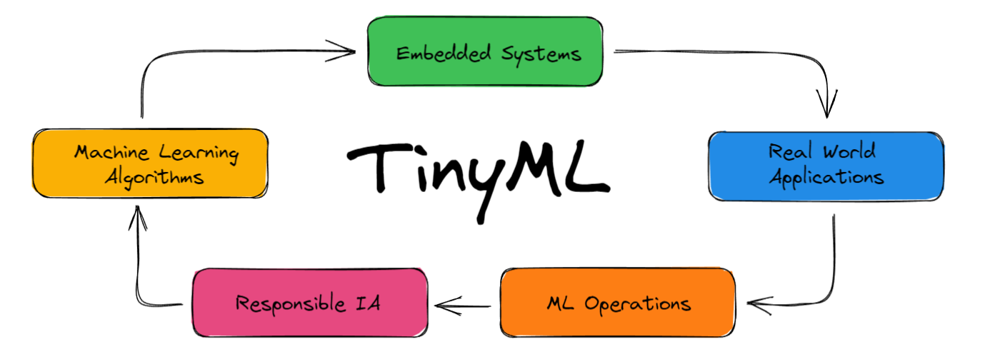

# DCA 0306 - Embedded Artificial Intelligence - UFRN

This is a repository created for the discipline of Embedded Artificial Intelligence, taught by Prof. Ivanovitch Silva, at the Federal University of Rio Grande do Norte - Brazil. 

Here I'll be displaying mainly contents created by me about the subject and the progress made troughtout the course. 

## :page_facing_up: Papers

- Vijay Janapa Reddi et al. Widening Access to Applied Machine Learning with TinyML 
  - My summary about the paper: 

- Intelligence at the Extreme Edge: A Survey on Reformable TinyML 
  - My summary about the paper: 

## :books: Reference 
- Ivanovitch's course repository ([Github](https://github.com/ivanovitchm/embedded.ai))
